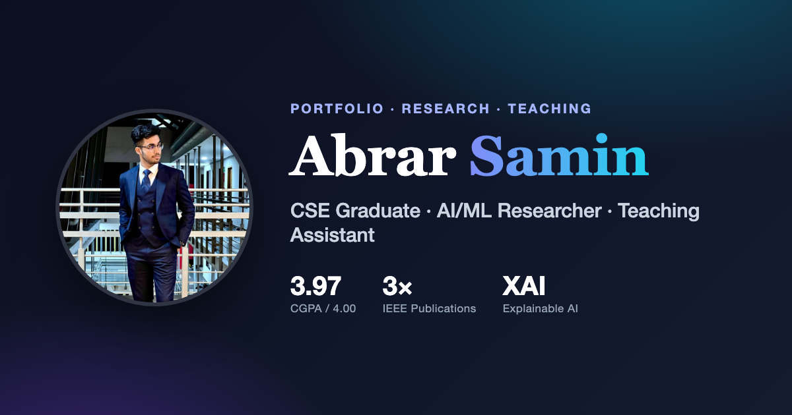

# Abrar Samin — Personal Portfolio

A fast, fully responsive academic & software-engineering portfolio built with **plain HTML5, CSS3, and vanilla JavaScript** — no frameworks, no build step, no backend. It deploys to **GitHub Pages** for free.

**Live site:** `https://notsaminnn.github.io/` *(after you deploy — see below)*



---

## ✨ Features

- **Responsive** across desktop, tablet, and mobile
- **Dark / light mode** with a toggle (remembers your choice, respects system preference, no flash on load)
- **Typing effect**, **scroll-reveal animations**, and **active-section nav highlighting**
- **Publication filtering** (All / Journal / Conference) with one-click **copy-citation**
- **Résumé download** (PDF) + a contact form that composes an email via your mail app
- **Scroll-to-top** button and smooth scrolling
- **SEO-ready:** meta description, Open Graph + Twitter cards, JSON-LD `Person` structured data, `sitemap.xml`, `robots.txt`
- **Accessible:** semantic HTML, skip link, ARIA labels, keyboard-friendly, `prefers-reduced-motion` support
- Loads fast — one small CSS file, one small JS file, optimized images

---

## 📁 File structure

```
mywebsite/
├── index.html              # All page content and sections
├── style.css               # Design system, layout, dark/light themes, animations
├── script.js               # Theme toggle, nav, typing, filtering, scroll spy, form
├── site.webmanifest        # PWA metadata (name, icons, colors)
├── robots.txt              # Search-engine crawl rules + sitemap pointer
├── sitemap.xml             # Sitemap for search engines
├── .nojekyll               # Tells GitHub Pages to serve files as-is (no Jekyll)
├── README.md               # This file
└── assets/
    ├── icons/
    │   ├── favicon.svg           # "AS" monogram favicon (SVG)
    │   ├── apple-touch-icon.png  # 180×180 iOS home-screen icon
    │   ├── icon-192.png          # PWA icon
    │   └── icon-512.png          # PWA icon (maskable)
    ├── img/
    │   ├── samin.jpg        # Hero portrait (720×720, optimized)
    │   ├── samin-400.jpg    # Smaller portrait (for future srcset use)
    │   └── og-image.png     # 1200×630 social-share preview image
    └── resume/
        ├── AbrarSamin_CV.pdf   # Downloadable résumé (linked by the button)
        ├── AbrarSamin_CV.docx  # Original editable CV
        └── resume.html         # Print-styled CV used to regenerate the PDF
```

---

## 🚀 Deploy to GitHub Pages

> **Before you publish:** the folder also contains files that are *not* part of the website —
> `NEW_PROJECT_GUIDE.md`, and the loose `samin_photo.jpg` / `AbrarSamin_CV.docx` at the repo root
> (the site uses copies inside `assets/`). GitHub Pages serves every file, so delete these first if
> you don't want them publicly reachable:
> ```bash
> rm NEW_PROJECT_GUIDE.md samin_photo.jpg AbrarSamin_CV.docx
> ```

You are already set up with the GitHub CLI (`gh`, logged in as **NotSaminnn**). Pick **one** of the two options.

### Option A — Personal site at `notsaminnn.github.io` (recommended)

A repository named exactly `<username>.github.io` is served at the root domain — the cleanest URL.

```bash
cd /Users/abrarsamin/Downloads/mywebsite
git init
git add -A
git commit -m "Initial portfolio site"
gh repo create NotSaminnn.github.io --public --source=. --push
```

Then enable Pages (once):

```bash
gh api -X POST repos/NotSaminnn/NotSaminnn.github.io/pages -f "source[branch]=main" -f "source[path]=/" 2>/dev/null || true
```

Or via the browser: **Repo → Settings → Pages → Build and deployment → Source: “Deploy from a branch” → Branch: `main` / `/ (root)` → Save.**

Your site goes live at **`https://notsaminnn.github.io/`** within a minute or two.

### Option B — Project repo (URL has a subpath)

```bash
cd /Users/abrarsamin/Downloads/mywebsite
git init
git add -A
git commit -m "Initial portfolio site"
gh repo create portfolio --public --source=. --push
```

Enable Pages the same way (Settings → Pages → branch `main` / root). Your site will be at
**`https://notsaminnn.github.io/portfolio/`**.

> All internal links in this project are **relative**, so the site works correctly whether it's served at the root *or* under a subpath. Only the absolute URLs in the SEO tags need updating — see below.

### Updating the site later

```bash
git add -A
git commit -m "Update content"
git push
```

---

## 🔧 Customize before / after deploying

Everything is plain text — open the files and edit. The most common changes:

| What | Where |
|------|-------|
| **Contact email** | Search `rsgidristee@gmail.com` in `index.html` and `script.js` and replace everywhere |
| **Name / headline / bio** | `index.html` — hero and `#about` sections |
| **Publications** | `index.html` — the `#publications` section (each `<li class="pub-card">`) |
| **Experience / education** | `index.html` — `#experience`, `#education` sections |
| **Skills** | `index.html` — `#skills` chips |
| **Brand colors** | `style.css` — the `:root` and `[data-theme="dark"]` token blocks (start with `--brand`, `--grad`) |
| **Typing roles** | `script.js` — the `roles` array |

### If you deploy under a subpath OR a custom domain

Update the **absolute** URLs (used by Google and social-media previews) so link previews work:

1. `index.html` — `<link rel="canonical">`, all `og:*` and `twitter:*` URLs, and the JSON-LD `url`/`image`.
2. `sitemap.xml` — the `<loc>` value.
3. `robots.txt` — the `Sitemap:` line.

Replace `https://notsaminnn.github.io/` with your actual site URL in those spots.

---

## 🖨️ Regenerating the résumé PDF

The PDF is generated from `assets/resume/resume.html`. Edit that file, then re-render with headless Chrome:

```bash
"/Applications/Google Chrome.app/Contents/MacOS/Google Chrome" \
  --headless=new --disable-gpu --no-pdf-header-footer \
  --print-to-pdf="assets/resume/AbrarSamin_CV.pdf" \
  "file://$(pwd)/assets/resume/resume.html"
```

(Or just open `resume.html` in any browser and use **Print → Save as PDF**.)

---

## 🖥️ Preview locally

Because everything is static, you can open `index.html` directly. For a closer-to-production preview with correct paths, run a tiny local server:

```bash
cd /Users/abrarsamin/Downloads/mywebsite
python3 -m http.server 8000
# then visit http://localhost:8000
```

---

## 🧾 License & credits

Content © Abrar Samin. Built with hand-written HTML, CSS, and JavaScript.
Fonts: [Inter](https://fonts.google.com/specimen/Inter) and [Fraunces](https://fonts.google.com/specimen/Fraunces) via Google Fonts. Icons are inline SVG.
